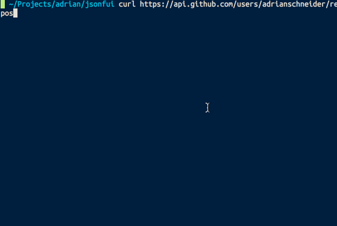
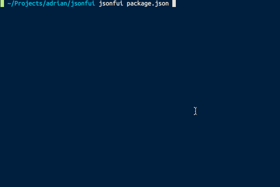

# jsonfui

jsonfui is an interactive command-line JSON viewer. [Examples](#examples)

## Installation

### Download Binary

Download [latest release](https://github.com/AdrianSchneider/jsonfui/releases) from GitHub (does not require node.js).

### npm Release

Or, install via npm (requires node.js):

```
npm install -g jsonfui
```

## Usage

To start jsonfui, pass a filename to it:

    jsonfui /path/to/file.json

You can also read from stdin instead of a file:

    curl -s https://api.github.com/users/adrianschneider/repos | jsonfui

You can also write to stdout with `Enter`:

    # list repos, pick one, view on github
    curl -s https://api.github.com/users/adrianschneider/repos | jsonfui | xargs open

When the application is open, you are in a vim-style tree viewer.

### Hotkeys (vim mode)

`down`, `j`: down
`up`, `k`: up
`left`, `h`: go back/up one level
`right`, `l`: view child node
`<Enter>`: send current selection to stdout and exit
`y` or `c`: copy current value to clipboard
`-`: toggle expansion
`/`: search for string recursively
`*`: search for value under cursor
`n`: next search result at current depth
`N`: prev search result at current depth
`<space>`: clear highlight

## Examples

### Reading from Standard In



### Reading from a File


